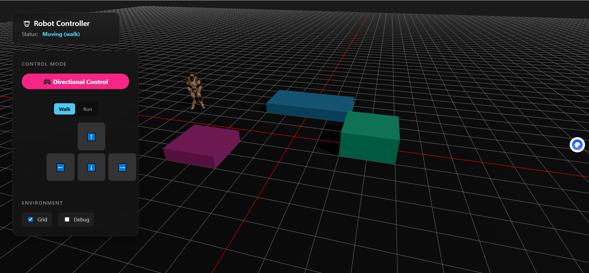
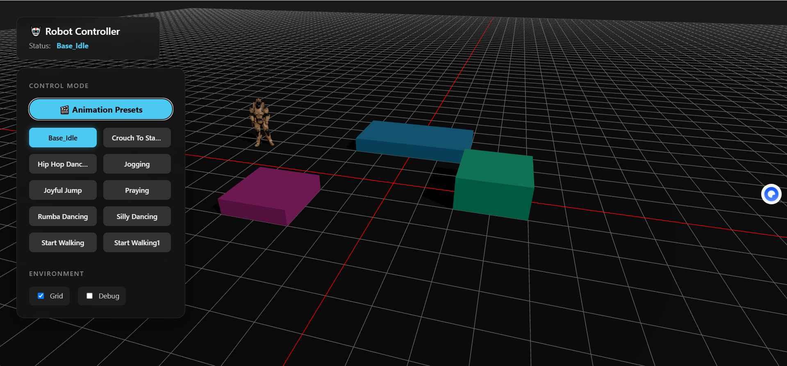

# 3D Robot Animation & Control

一个基于 React + Three.js 的高性能 3D 机器人交互演示项目。支持动画预设播放与实时方向控制。

## ✨ 核心功能

- **双模式控制系统**：
  - **🎬 动画模式**：一键播放多种预设动作（跳舞、祈祷、跳跃等），支持动态加载新动作文件。
  - **🎮 操控模式**：WASD/方向键风格的实时移动控制，支持“行走”与“奔跑”两种速度切换。
- **智能资源管理**：
  - 自动扫描 `public/` 目录下的 FBX 文件并生成动画列表。
  - 启动时自动更新模型配置。
- **沉浸式环境**：
  - 基于 `@react-three/cannon` 的物理碰撞检测。
  - 动态光照与阴影系统。
  - 可配置的网格辅助线与调试模式。

## 📸 界面预览

### 🎮 方向控制模式
支持前后移动与左右旋转，实时切换行走/奔跑状态。


### 🎬 模型动画模式
自动加载并展示所有可用动画预设。


## 🛠️ 技术栈

- **核心框架**: React 18, TypeScript, Vite
- **3D 引擎**: Three.js, @react-three/fiber, @react-three/drei
- **物理引擎**: @react-three/cannon
- **状态管理**: Zustand
- **UI 交互**: Framer Motion

## 🚀 快速开始

1. **安装依赖**
   ```bash
   npm install
   ```

2. **启动开发服务器**
   ```bash
   npm run dev
   ```
   启动后会自动执行模型扫描脚本，访问 `http://localhost:5173` 即可体验。

3. **添加新动画**
   - 将 `.fbx` 动画文件放入 `public/` 目录。
   - 重启服务，新动作将自动出现在列表中。

## 📂 目录结构

- `src/components/canvas`: 3D 场景组件 (Robot, Environment)
- `src/components/dom`: UI 界面组件 (Overlay)
- `src/store`: 全局状态管理
- `src/config`: 自动生成的模型配置文件
- `public`: 模型与静态资源

## 📄 License

MIT
